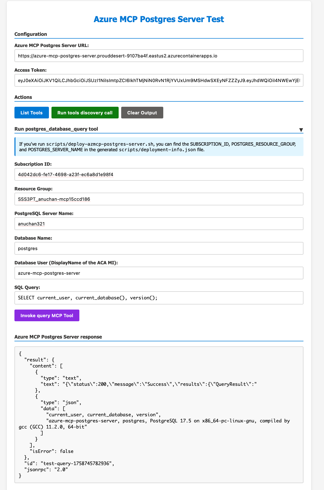
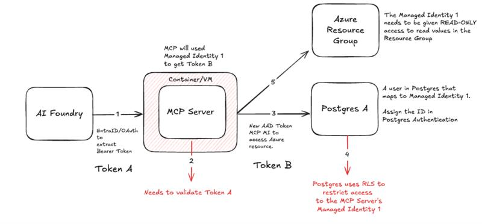

# Azure MCP PostgreSQL Server

This repository provides a prototype of a self-hosted "Azure MCP Server" - hosted on Azure Container Apps (ACA) - that enables secure access to PostgreSQL databases using ACA Managed Identity.

## Components

The system consists of three main components:

1. **AI Foundry Agent** (Client): Authenticates to the Azure MCP Server using its Managed Identity.  
   *Note: This prototype uses Azure Container Instance (ACI) with MI as substitute client (identical token acquisition as future AI Foundry MI, expected in early October under a feature flag).*

2. **Azure MCP PostgreSQL Server** (Server): Runs in Azure Container Apps (ACA), using ACA Managed Identity for PostgreSQL access.

3. **PostgreSQL Database** (Target): Azure Database for PostgreSQL Flexible Server with Entra ID authentication enabled.

**Identity Separation**: Two separate managed identities are used - the client MI (ACI/AI Foundry) authenticates to the MCP Server, while the MCP Server uses its own ACA MI to access PostgreSQL, ensuring proper security isolation.

## Prerequisites


- [Azure CLI](https://docs.microsoft.com/en-us/cli/azure/install-azure-cli)  
- [Docker Desktop](https://www.docker.com/products/docker-desktop)  
- [PostgreSQL Client](https://www.postgresql.org/download/)  
- Azure Database for PostgreSQL Flexible Server

## Getting Started

### Step 1: Verify PostgreSQL Connection

Connect locally before deploying the MCP server:

1. Navigate to your PostgreSQL server in the Azure portal
2. Follow the steps in the **Connect** section to set up Microsoft Entra ID authentication
3. Connect using `psql`:


4. Launch the PostgreSQL client:
```bash
psql
```

5. Inside `psql`, run:
```sql
\conninfo
```

You should see output similar to:


### Step 2: (Server) Deploy Azure MCP PostgreSQL Server to Azure Container App

1. Start Docker  
2. Login to Azure:
   ```bash
   az login
   az account set --subscription "your-subscription-id"
   ```
3. Run deployment script:
   ```bash
   chmod +x scripts/deploy-azmcp-postgres-server.sh 
   ./scripts/deploy-azmcp-postgres-server.sh --postgres-resource-id "/subscriptions/{sub}/resourceGroups/{rg}/providers/Microsoft.DBforPostgreSQL/flexibleServers/{server}" --resource-group "{rg-for-mcp-server-aca}"
   ```

<details>
<summary>Example Output (deployment-info.json)</summary>
<br/>

The script creates a `deployment-info.json` file with all the deployment details:

```json
{
   "MCP_SERVER_URI": "https://<mcp-server-uri>",
   "ENTRA_APP_CLIENT_ID": "<entra-app-client-id>",
   "ENTRA_APP_OBJECT_ID": "<entra-app-object-id>",
   "ENTRA_APP_SP_OBJECT_ID": "<entra-app-sp-object-id>",
   "ENTRA_APP_ROLE_VALUE": "<entra-app-role-value>",
   "ENTRA_APP_ROLE_ID_BY_VALUE": "<entra-app-role-id-by-value>",
   "ACA_MI_PRINCIPAL_ID": "<aca-mi-principal-id>",
   "ACA_MI_DISPLAY_NAME": "<aca-mi-display-name>",
   "RESOURCE_GROUP": "<resource-group>",
   "SUBSCRIPTION_ID": "<subscription-id>",
   "POSTGRES_SERVER_NAME": "<postgres-server-name>",
   "POSTGRES_RESOURCE_GROUP": "<postgres-resource-group>",
   "LOCATION": "<location>"
}
```

</details>

### Step 3: Configure PostgreSQL Database Access

In `psql` terminal (from Step 1):

```sql
SELECT * FROM pgaadauth_create_principal('<ACA_MI_DISPLAY_NAME>', false, false);
```

Replace `<ACA_MI_DISPLAY_NAME>` with the value from `deployment-info.json` (output of step 2) (e.g., `azure-mcp-postgres-server`).

### Step 4: (Client) Deploy MI enabled Azure Container Instance 

Deploy an ACI that can be used to test the Azure MCP Postgres server.

```bash
chmod +x scripts/deploy-aci-client.sh
./scripts/deploy-aci-client.sh
```

<details>
<summary>Example Output of the script</summary>

The script will output instructions for connecting to the ACI and testing the Azure MCP Postgres Server:

```bash
[INFO] To verify the MCP server connection, you can:

1. Connect to the ACI container:
   az container exec --resource-group "{resource-group}" --name "aci-mcp-verify" --exec-command "/bin/sh"

2. Inside the container, get an access token for the MCP server:
   TOKEN_RESPONSE=$(curl -s "http://169.254.169.254/metadata/identity/oauth2/token?api-version=2018-02-01&resource={ENTRA_APP_CLIENT_ID}" -H "Metadata: true")
   ACCESS_TOKEN=$(echo "$TOKEN_RESPONSE" | jq -r .access_token)

3. Test the MCP server endpoints:
   # List available tools
   curl -X POST "{mcp-server-url}" \
     -H "Content-Type: application/json" \
     -H "Authorization: Bearer $ACCESS_TOKEN" \
     -d '{"jsonrpc": "2.0", "id": "test", "method": "tools/list", "params": {}}'

4. Access token for mcp-client.html:
   echo $ACCESS_TOKEN

5. Clean up the ACI when done:
   az container delete --resource-group "{resource-group}" --name "aci-mcp-verify" --yes
```

</details>

### Step 5: (Optional) Web Client

The repository includes a web-based MCP client for easy testing:

1. Open `mcp-client.html` in your browser  
2. Enter `MCP_SERVER_URI` from `deployment-info.json`  
3. Paste the `ACCESS_TOKEN` from ACI  
4. Run tools (list tools, invoke execute query tool, etc.)  

<details>
<summary>Example: Invoke execute query tool</summary>



</details>

## Appendix

### AI Foundry Project Managed Identity Authentication Flow

For detailed information about how AI Foundry projects will authenticate to Azure MCP servers using managed identity, including SDK usage patterns and sequence diagrams, see: [AI Foundry Project Managed Identity Server Authentication](https://gist.github.com/anuchandy/0726a2565431aaa46616c55830dda241).

### Architecture Diagram

<details>
<summary>Architecture diagram provided by abeomorogbe@microsoft.com and kkravi@microsoft.com</summary>



</details>