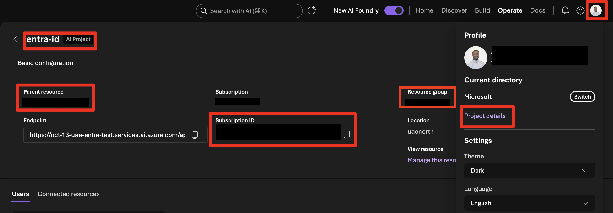
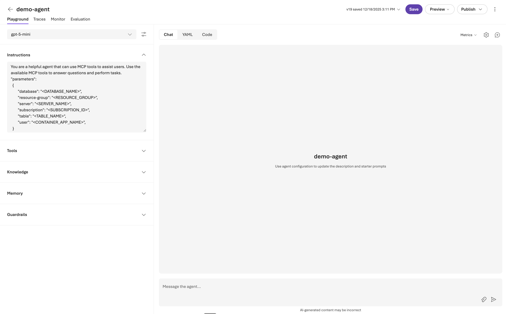

# Azure MCP PostgreSQL Server Demo

This is a demo repo that will show you how to setup the **Azure Database for Postgres MCP server** that enables AI agents to interact with Azure PostgreSQL databases through natural language queries. Supports SQL operations, schema discovery, and data analysis with enterprise-grade security.

This server is a part of the **[Azure MCP Server](https://learn.microsoft.com/en-us/azure/developer/azure-mcp-server/)**. This repo will show you how to enable the Postgres specific features and how to connect it **Azure AI Foundry** and other MCP clients to interact with Azure Database for Postgres via MCP

## Features

- 🔍 **SQL Operations** - Execute queries, manage data, perform analytics
- 📊 **Schema Discovery** - Automatic table and column analysis
- 🔐 **Enterprise Security** - Azure managed identity and Entra ID authentication  
- 🎯 **Natural Language** - Query databases using conversational AI
- 🚀 **Easy Deployment** - One-click Azure deployment with complete infrastructure

## Components

The system consists of three main components:

1. **AI Foundry Agent** (Client): Authenticates to the Azure MCP Server using its Managed Identity.  

2. **Azure MCP PostgreSQL Server** (Server): Runs in Azure Container Apps (ACA), using ACA Managed Identity for PostgreSQL access.

3. **PostgreSQL Database** (Target): Azure Database for PostgreSQL Flexible Server with Entra ID authentication enabled.

**Identity Separation**: Two separate managed identities are used - the client MI (AI Foundry) authenticates to the MCP Server, while the MCP Server uses its own ACA MI to access PostgreSQL, ensuring proper security isolation.

## Prerequisites

- [Azure CLI](https://docs.microsoft.com/en-us/cli/azure/install-azure-cli)  
- [Docker Desktop](https://www.docker.com/products/docker-desktop)  
- [PostgreSQL Client](https://www.postgresql.org/download/)  
- [Azure Database for PostgreSQL Flexible Server](https://learn.microsoft.com/en-us/azure/postgresql/flexible-server/overview)
- [Microsoft .NET](https://dotnet.microsoft.com/en-us/download)

## Quick start deployment

Deploy the complete Azure MCP PostgreSQL Server infrastructure by using Azure Developer CLI (azd):

### Step 1: Deploy with azd up
The fastest way to get started is by using the automated deployment script. 

1. First, clone [the repo](https://github.com/Azure-Samples/azure-postgres-mcp-demo):

    ```bash
    # Clone the repository
    git clone https://github.com/Azure-Samples/azure-mcp-postgresql-server
    cd azure-mcp-postgresql-server
    ```

2. Open [infra/main.parameters.json](/infra/main.parameters.json) and update these 2 values 
   
    | Parameter              | Description                                                                             |
    | ---------------------- | --------------------------------------------------------------------------------------- |
    | `postgresResourceId`   | Resource ID of the Azure Database for PostgreSQL Flexible Server you want to connect to |
    | `aifProjectResourceId` | Resource ID of the Azure AI Foundry project you want to use                             |

    a. Update the [`postgresResourceId`](https://github.com/Azure-Samples/azure-postgres-mcp-demo/blob/1f94c56bdd8ab4b383fdfc8eac23b05db2c4b09f/infra/main.parameters.json#L17) variable to match the Postgres DB you want to access. 
    
    ```json
    "postgresResourceId": {
    "value": "/subscriptions/<subscription-id>/resourceGroups/<postgres-resource-group>/providers/Microsoft.DBforPostgreSQL/flexibleServers/<postgres-server-name>"
    }
    ```
    > [!Note]
    Find your Azure Database for PostgreSQL subscription ID, resource group, and server name in your Azure portal:
    


    b. Update the [`aifProjectResourceId`](https://github.com/Azure-Samples/azure-postgres-mcp-demo/blob/1f94c56bdd8ab4b383fdfc8eac23b05db2c4b09f/infra/main.parameters.json#L20) variable to match the AI Foundry resource you want to use
    ```json
    "aifProjectResourceId": {
    "value": "/subscriptions/<subscription-id>/resourceGroups/<aifoundry-resource-group>/providers/Microsoft.CognitiveServices/accounts/<aifoundry-resource-name>/projects/<aifoundry-project-name>"
        },
    ```

    > [!Note]
    Find your Azure AI Foundry project name, subscription ID, and parent resource name in your AI Foundry Portal. By clicking **Profile Icon** → **Project Details**:
    

3. Deploy:
   
    ```bash
    azd up
    ```

    After deployment completes, azd will output the MCP server URL + Managed Identity info you’ll use in the next steps.

This deployment creates:
- Azure Container Apps instance for the MCP server
- Managed Identity for secure authentication
- Microsoft Entra ID App Registration with proper Role-based access control (RBAC) configuration
- All necessary networking and security configurations


### Step 2: Configure database access
1. Connect to your PostgreSQL server using `psql` or your preferred PostgreSQL client:

   Set the following environment variables by copying and pasting the lines below into your bash terminal (WSL, Azure Cloud Shell, etc.). 

   ```bash
   export PGHOST=<your-database-host-name>
   export PGUSER=<your-admin-username>
   export PGPORT=5432
   export PGDATABASE=<your-database-name>
   export PGPASSWORD="$(az account get-access-token --resource https://ossrdbms-aad.database.windows.net --query accessToken --output tsv)" 
   ```

   Then run:
   ```bash
   psql
   ```

   Alternatively, you can connect via the [PostgreSQL VSCode extension](https://learn.microsoft.com/en-us/azure/postgresql/extensions/vs-code-extension/quickstart-connect#add-a-connection-to-postgresql)

1. Create the database principal for the MCP server's managed identity:

    ```sql
    SELECT * FROM pgaadauth_create_principal('<ACA_MI_DISPLAY_NAME>', false, false);
    ```

    Replace `<ACA_MI_DISPLAY_NAME>` with the value from `deployment-info.json` (output of step 2) (e.g., `azure-mcp-postgres-server`).

1. *(Optional)* If you add new tables to your database, you will have to grant the MCP server permissions to the new tables.
   
   ```sql
   GRANT SELECT ON my_table TO "<ACA_MI_DISPLAY_NAME>";
   ```

    For all tables
    ```sql
    -- Grant SELECT on all existing tables
    GRANT SELECT ON ALL TABLES IN SCHEMA public TO "<ACA_MI_DISPLAY_NAME>";

    -- Grant SELECT on all future tables
    ALTER DEFAULT PRIVILEGES IN SCHEMA public GRANT SELECT ON TABLES TO "<ACA_MI_DISPLAY_NAME>";
    ```

## Configure Azure AI Foundry integration

After you deploy your MCP server, connect it to Azure AI Foundry:

### Connect via Azure AI Foundry portal

1. Navigate to your Azure AI Foundry project
2. Go to **Build** → **Create agent**  
3. Select the **+ Add** in the tools section
4. Select the **Custom** tab 
5. Choose **Model Context Protocol** as the tool and click **Create** 
6. Select **Microsoft Entra** → **Project Managed Identity**  as the authentication method 
7. Enter your <entra-app-client-id> as the audience. This is value from the output of your azd up command. 
> [!Note]
>  Use `azd env get-values` command to find the `ENTRA_APP_CLIENT_ID` value
1. Add instructions to your agent. 
   
    Give the agent instructions:

    ```
    You are a helpful agent that can use MCP tools to assist users. Use the available MCP tools to answer questions and perform tasks.
    "parameters":      
      {
            "database": "<DATABASE_NAME>",
            "resource-group": "<RESOURCE_GROUP>",
            "server": "<SERVER_NAME>",
            "subscription": "<SUBSCRIPTION_ID>",
            "table": "<TABLE_NAME>",
            "user": "<ACA_MI_DISPLAY_NAME>",       
      },
    "learn": true
    ```


### Test the integration

After you connect, test your MCP integration with natural language queries.

You can discover tables.

```copilot-prompt
List all tables in my PostgreSQL database
```

You can retrieve records with natural language.

```copilot-prompt
Show me the latest 10 records from the orders table
```

```copilot-prompt
Find customers who placed orders in the last 30 days
```

You can do vector search and specify example queries to improve accuracy.

```copilot-prompt
Do a vector search for "product for customer that love to hike"
```

This is an example of a vector search.

```sql
- `SELECT id, name, price, embedding <=> azure_openai.create_embeddings(
'text-embedding-3-small',
'query example'
)::vector AS similarity
FROM public.products
ORDER BY similarity
LIMIT 10;
```

The AI agent automatically translates these requests into appropriate database operations through the MCP server.

### Connect via Azure AI Foundry SDK

For programmatic access, use the following MCP configuration in your Python code:

``` python
mcp_tool_config = {
    "type": "mcp",
    "server_url": <mcp_server_url>,
    "server_label": <mcp_server_label>,
    "server_authentication": {
        "type": "connection",
        "connection_name": <connection_name>,
    }
}

mcp_tool_resources = {
    "mcp": [
        {
            "server_label": <mcp_server_label>,
            "require_approval": "never"
        }
    ]
}
```

[Full SDK sample](client/agents_mcp_sample.py) in the the client folder 

## Example Queries

#### Basic Database Operations
```
List all tables in the database
```
```
Show the schema for the 'customers' table  
```
```
Get the first 10 rows from the 'orders' table
```
```
Count total records in the 'products' table
```

#### Data Analysis
```
Find customers who placed orders in the last 30 days
```
```
Show me the top 5 best-selling products by quantity
```
```
Calculate average order value by customer segment
```
```
Analyze sales trends by month for this year
```

#### Schema Exploration
```
What tables are available in this database?
```
```
Describe the relationship between orders and customers tables
```
```
Show me all foreign key constraints in the database
```
```
Find tables that contain customer information
```

## Configuration

### Environment Variables

#### Client Configuration (.env file)
| Variable | Required | Description | Example |
|----------|----------|-------------|---------|
| `PROJECT_ENDPOINT` | Yes | AI Foundry project endpoint | `https://example-endpoint.services.ai.azure.com/api/projects/example-project` |
| `MODEL_DEPLOYMENT_NAME` | Yes | AI model deployment name | `gpt-4o` |
| `MCP_SERVER_URL` | Yes | MCP server endpoint URL | `https://example-mcp-server.azurecontainerapps.io` |
| `MCP_SERVER_LABEL` | Yes | Label for the MCP server | `azure-postgres-mcp` |
| `AZURE_OPENAI_API_KEY` | Yes* | Azure OpenAI API key | `your-azure-openai-api-key` |
| `AZURE_OPENAI_ENDPOINT` | Yes* | Azure OpenAI service endpoint | `https://example-openai-endpoint.openai.azure.com/` |
| `AZURE_OPENAI_API_VERSION` | Yes* | Azure OpenAI API version | `2024-02-01` |

*Either use API key or managed identity authentication

#### Sample .env file
Check [.env.example](client/.env.example)

### Authentication & Security

#### Azure Deployment
Uses managed identity with these permissions:
- **PostgreSQL Database Contributor** role on the target PostgreSQL server
- **Entra ID Authentication** for secure database access

## Troubleshooting

### Health Check
```bash
# Check MCP server status
curl https://your-mcp-server.azurecontainerapps.io/health
```

### Common Issues

#### Authentication Errors
- **Error**: `Unauthorized` or `Forbidden`
- **Solution**: Verify managed identity configuration and PostgreSQL access permissions

#### Connection Issues
- **Error**: `Connection timeout` or `Cannot connect to server`
- **Solution**: Check PostgreSQL firewall rules and network configuration

#### Permission Errors
- **Error**: `Permission denied for relation`
- **Solution**: Ensure the managed identity has appropriate database permissions

```sql
GRANT SELECT ON my_table TO "<ACA_MI_DISPLAY_NAME>";
```

### Debug Mode

#### View Logs
```bash
# Stream Container Apps logs
az containerapp logs tail --name your-mcp-server --resource-group your-resource-group

# Check deployment status
az containerapp show --name your-mcp-server --resource-group your-resource-group
```

## Security Considerations

⚠️ **IMPORTANT SECURITY NOTICE**

This MCP server uses Entra ID and Managed Identity for secure PostgreSQL access:

### Data Access and Exposure
- **Any data accessible to this MCP server can potentially be exposed to connected AI agents**
- The MCP server can execute SQL queries on accessible databases and tables
- Connected agents may request and receive data through natural language queries

### Security features
You can use the following [security features](security-overview.md#access-control) to protect your data:

- **Managed Identity**: No credentials stored in container images.
- **Microsoft Entra ID Authentication**: Secure database authentication.
- **RBAC**: Role-based access control for database operations.
- **Row Level Security**: Fine-grained access control at the row level.

### Best practices
- **Grant database permissions ONLY to specific schemas and tables** needed for AI agents
- Use principle of least privilege - don't grant broad database access
- Regularly review and audit permissions granted to the MCP server's identity
- Consider using dedicated databases or schemas for AI agent access
- Start with a dedicated test database containing only non-sensitive sample data.

## Appendix

### AI Foundry Project Managed Identity Authentication Flow [Needs to be updated]

For detailed information about how AI Foundry projects will authenticate to Azure MCP servers using managed identity, including SDK usage patterns.

### Technical Details
The Azure Postgres MCP server is a subset of the [Azure MCP Server](https://github.com/microsoft/mcp/tree/main/servers/Azure.Mcp.Server).

### Architecture Diagram

<details>
<summary>Architecture diagram</summary>


</details>

## Additional Resources

- **[Azure Container Apps Documentation](https://docs.microsoft.com/azure/container-apps/)**
- **[Azure MCP Server](https://learn.microsoft.com/en-us/azure/developer/azure-mcp-server/)**
- **[Azure Database for PostgreSQL Documentation](https://docs.microsoft.com/azure/postgresql/)**
- **[Model Context Protocol Specification](https://spec.modelcontextprotocol.io/)**
- **[AI Foundry Documentation](https://docs.microsoft.com/azure/ai-foundry/)**


## Contributing

### Development Workflow
1. **Fork and clone** the repository
2. **Create feature branch** from `main`
3. **Test locally** using Docker
4. **Deploy to test environment**
5. **Submit pull request** with comprehensive testing

If you want to contribute to the Azure MCP server wich includes teh Azure Postgres MCP follow the [Contribution Guide](https://github.com/microsoft/mcp/blob/main/CONTRIBUTING.md)

## Support

- **Health**: `GET /health` endpoint for server status
- **Issues**: GitHub Issues with logs and configuration details
- **Monitoring**: Azure Container Apps logs and Application Insights